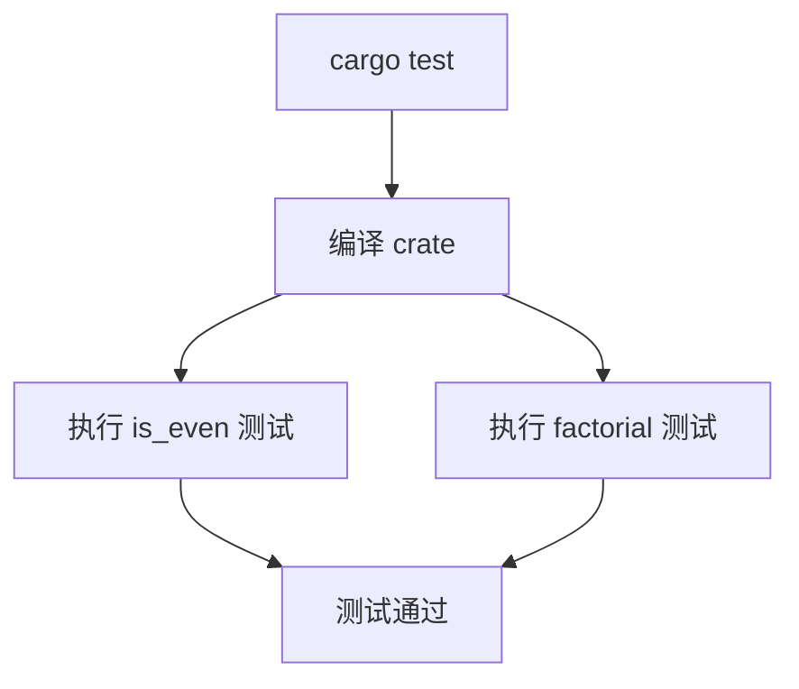

# HLD - even-factorial

## 架构目标

该测试仓库采用单文件 Rust binary crate，保留足够小的实现范围，同时验证函数、测试和构建命令的完整执行链路。

## 组件设计

| 组件 | 职责 |
| --- | --- |
| `Cargo.toml` | 声明 Rust 包元数据。 |
| `src/main.rs` | 承载两个公共函数、可选的 `main` 函数和内联测试模块。 |

## 执行流程

## 技术决策

`factorial` 可使用迭代乘法实现，以避免递归带来的栈深度讨论。测试直接放在 `src/main.rs` 中，便于最小仓库交付。
